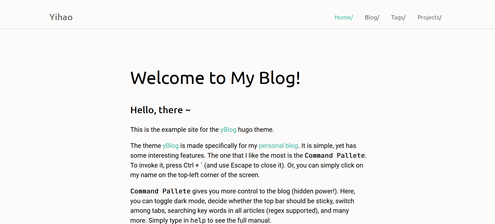
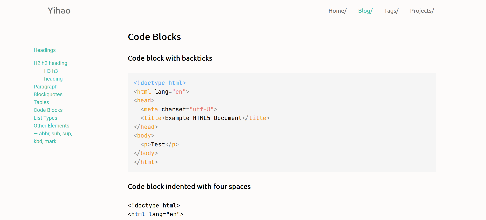
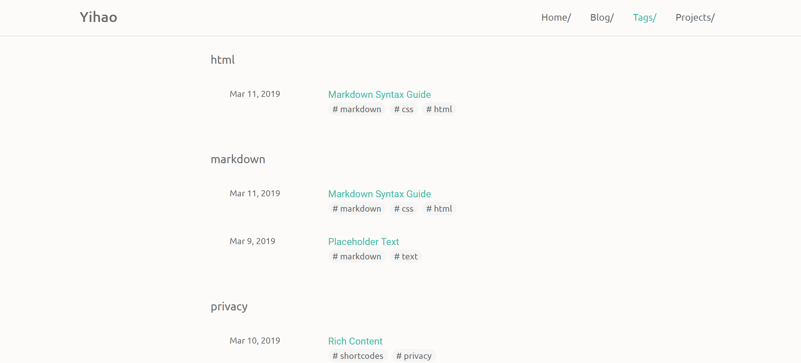
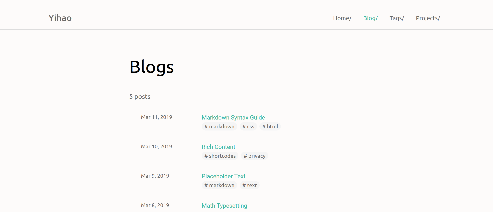

# yBlog

[yBlog](https://coderyihaowang.github.io/yblog) is a [Hugo](https://gohugo.io) theme that was made specifically for my [personal blog](https://coderyihaowang.github.io). 

_Home page_

_Blog age_

_Tags page_

_Blog list page_

This theme is designed to be simple and clean, yet it has some interesting features. The one that I like the most is **`Command Pallete`**. To invoke it, press Ctrl + ` (and use Escape to close it). Or, you can simply click on the title on the top-left corner of the screen.

**`Command Pallete`** gives you more control to the blog (hidden power!). Using it, you can toggle dark mode, decide whether the top bar should be sticky, switch among tabs, searching articles that contains a keyword (regex supported), and more. Simply type `help` in the Command Pallete to see the [full manual](https://coderyihaowang.github.io/yBlog/help).

Here is a quick demo:

This theme is made for my personal use, therefore pull requests will be ignored. But you are welcome to fork and modify it for your own.

This theme was inspired by [USWDS Hugo Theme](https://github.com/zwbetz-gh/uswds-hugo-theme)